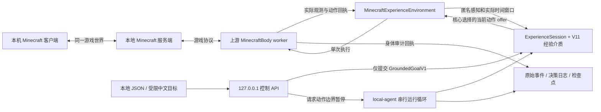

# Minecraft 本地接入与 Kairos 架构审查

审查日期：2026-09-23。范围包括旧 `mc-agent` 的感知、目标输入、学习、规划、动作执行、结果报告及存档，以及新本地入口对上游最新版的接线。本文区分代码接入完成、软件测试通过与原生任务能力；三者不能互相替代。

> 存档说明（2026-09-28）：本文描述的 Kairos 运行时线已整体归档到 `legacy/kairos/`（本目录的上一级），不是 mc-agent 的当前主线；下文相对链接已按归档后的位置修正。

当前默认入口是 [`local-agent.mjs`](../local-agent.mjs)。游戏状态由本地 Minecraft 服务端维护，用户通过本机 Minecraft 客户端观看同一世界；浏览器渲染器不在新入口中启动。HTTP 服务只是本地控制和诊断接口。旧的交互、概念和直播入口原文保存在 [`legacy/box-world/`](../../box-world/)，供审查取证，不作为新版能力实现。

## 1. 对齐的上游与运行边界

[`upstream.lock.json`](../upstream.lock.json) 固定了以下来源：

| 项目 | 当前锁定值 |
| --- | --- |
| 仓库 | [vasily-tolkyov/kairos-v5-predictive-agent](https://github.com/vasily-tolkyov/kairos-v5-predictive-agent) |
| 检查时的 main 提交 | [`fb3c40a8e172e092ca6ba9a69eebc2836e255b36`](https://github.com/vasily-tolkyov/kairos-v5-predictive-agent/tree/fb3c40a8e172e092ca6ba9a69eebc2836e255b36) |
| 包版本 | `0.4.0` |
| 核心入口 | `dist/src/prototype.js` |
| 会话格式 | `ExperienceSession1` |
| 经验介质格式 | `KairosExperienceMediumV11` |
| 实际游戏协议 | 本地 Minecraft Java `1.21.4`，`127.0.0.1:25567` |

启动检查 Git 提交、受跟踪文件是否改动、构建产物摘要及介质格式。构建摘要在 [`core-build.lock.json`](../core-build.lock.json) 中，由 [`scripts/core-build-lock.mjs`](../scripts/core-build-lock.mjs) 核验。更新上游应重建、复核兼容性并更新锁，不能只修改版本字符串。

旧 `energy-network-sim` 的 `TransitionMemory`、四维箱子状态表和 `exploration-episodes.json` 不兼容新版经验介质。新入口明确拒绝把旧存档改个版本名后恢复，也没有把旧实验表灌入 V11。

新版身体观测沿用上游 RGBD 感知与本体信号。它不是读取用户显示器截图的视觉模型；Minecraft 客户端用于展示，身体适配器负责取样。经过 `MinecraftExperienceEnvironment` 匿名化后的实际观测进入学习。目标和计划不成为训练窗口；动作前后真实帧及动作回执才进入经验介质。

## 2. 改前与改后

| 环节 | 旧实现 | 新默认入口 |
| --- | --- | --- |
| 展示 | `prismarine-viewer` 第一、第三人称网页；另有相机进程 | 本机 Minecraft 客户端观看本地服务端；新入口不启动网页 viewer |
| 核心 | 相对路径导入 `energy-network-sim/dist`，版本和构建无校验 | 固定上游提交、构建摘要和 V11/Session1 契约 |
| 状态输入 | `zone/lane/carry/stack` 人工离散状态，固定坐标查方块 | 上游身体的实际公共观测，经 Minecraft 经验环境送入核心 |
| 指令输入 | 外部 Jev API 把中文压缩到四个箱子维度 | `GroundedGoalV1` JSON；明确受限的本地中文语法，无云端解析依赖 |
| 学习来源 | 全状态重置实验、回放初始表；概念进程独立运行 | 上游 `ExperienceSession` 消费真实主动及被动时间窗口 |
| 正式执行 | `executeGoal` 仍调用会 `/tp /give /fill` 的实验台 | 由上游核心选择当前可用 offer，身体执行并反馈；新运行循环不重置世界 |
| 控制排队 | 一个 pending 字符串，执行阶段不可取消 | 同步 `session.submit`；重复 ID 和容量错误返回明确状态，动作仍由单循环串行执行 |
| 暂停 | 无统一动作边界、持久化和退出协议 | 请求暂停，当前动作结束后保存并退出；恢复显式加载检查点 |
| 输出 | 自由文本状态、部分经验表 | 任务状态、实际回执、决策日志、原始事件、带来源清单的检查点 |
| 失败解释 | 满规划预算、少数变体失败也可说“确实做不到” | 保留核心 plan reason、任务 pending/verified、停止原因；预算结束不等于不可达 |

新本地控制边界在 [`local-control.mjs`](../local-control.mjs)：

- 只绑定 loopback，并校验 Host、Origin 和跨站请求标识；POST 要求 JSON。
- 请求体限 8 KiB；异常 JSON 不导致进程崩溃。
- 目标版本、表达树、谓词、主体、可观察量、有限数及重复谓词 ID 均校验；表达树限制深度和总节点数。
- `POST /goals` 只提交目标；`POST /instruct` 只把受支持的表达转换为目标，不生成动作脚本。
- `POST /pause` 仅接受空对象或 `paused:true`。返回的 pending 状态表示已受理，落盘完成要看运行目录中的 `result.json`、检查点及退出日志。
- `GET /status`、`GET /state` 提供操作员可读状态。HTTP 受理成功不意味着目标已达到。

[`test/local-control.test.mjs`](../test/local-control.test.mjs) 的 5 个测试已通过，覆盖上述边界，包括 chunked 请求大小限制、非法有限数、重复目标、队列容量及暂停后拒绝新任务。这是接口测试，不是原生任务成功证据。

## 3. 旧实现的具体问题

以下行号对应保留的旧源码原文。`mc-bench.cjs` 和 `perception-spec.cjs` 仍在项目根目录；三个旧 agent 引用 `legacy/` 中的副本。

| 优先级 | 位置 | 触发条件与影响 | 新入口的处理 / 后续原则 |
| --- | --- | --- | --- |
| P1 | `mc-bench.cjs:87–97`；`legacy/interactive-agent.cjs:205,236,295` | 正式执行与覆盖探索共用 `conduct`，每步传送、清包、发物品、清空和重建堆垛。执行不再是一个连续世界，来源物品还会被再生 | 新入口不调用该实验台。今后若保留实验设施，重置操作必须属于独立评测准备，不能在策略动作路径中 |
| P1 | `legacy/interactive-agent.cjs:100–115` | 请求体无大小限制，`JSON.parse` 和 `.trim()` 无防护；畸形输入会抛出未捕获异常。`listen(3008)` 未指定 loopback | 新 API 加入边界校验、明确状态码和本地绑定 |
| P1 | `mc-bench.cjs:69–72,122,144,155`；`legacy/concept-agent.cjs:68–72` | 未加载方块被当作空气或零堆垛；部分读数直接访问 `.name`。断线或区块未就绪可能污染标签或抛异常 | 保持 unknown 与观测值分离；新版身体窗口仍应通过断线、重生、区块加载测试验证这一边界 |
| P1 | `legacy/interactive-agent.cjs:120–140`；`mc-bench.cjs:175` | 所有连接共用一个 `online` 标志。旧异步实验尚未结束时新连接已上线，旧实验可能通过最后的 online 检查并提交旧 bot 数据 | 新入口故障时保存并退出，恢复使用新 run；不继续旧连接中的悬空动作 |
| P2 | `perception-spec.cjs:23`；`legacy/interactive-agent.cjs:167–185` | `clarityAsk` 不包含维名；四个问题均为“该维度是否明确”。候选只含 0–2 层，后置数值越界检查无法识别“摞三层”被误映射成 2 | 当前本地解析明确拒绝箱子语义；未来解析必须保留不支持或歧义，不能强行投到候选值 |
| P2 | `legacy/interactive-agent.cjs:194` | 变体过滤删除当前状态。用户的目标已满足时，也可能选择改变未指定维度，或没有变体后进入失败流程 | 使用实际观测上的目标谓词评价；已满足还需按上游协议做后续实际确认 |
| P2 | `legacy/interactive-agent.cjs:194,201,247` | 只试四个变体、连续两个失败就称结构不可达；`prediction-budget` 也最终说“现有动作确实做不到” | 搜索预算、证据不足、动作拒绝和逻辑不可达必须分开报告；有限搜索不能证明不可达 |
| P2 | `legacy/interactive-agent.cjs:109,146,227–236`；`mc-bench.cjs:107–169` | 用户执行和 80 次定向复验不可取消；多个 20 秒 goto、dig、重试可超过“≤1 分钟”承诺 | 新入口在动作边界暂停；不要承诺未经测量的最坏响应时间 |
| P2 | `legacy/interactive-agent.cjs:338–363` | 回放签名仅记录档位数量，不含世界、适配器和核心版本；Map 覆盖同条件多次结果。只有初始探索落盘，后续补强与任务经验不会进入该存档 | 新入口保留会话快照、实际事件和上游版本来源；进一步完善世界 epoch 与完整性核验 |
| P2 | `legacy/concept-agent.cjs:24–35,94–107,175–184` | 手工方块词表、邻域类型计数和教师反推标签，且概念输出没有接入规划状态或 `TransitionMemory` | 旧演示证明的是给定数值特征上的概念形成读出，不能称对象语义已自主接地；新版走统一感知—经验闭环 |
| P2 | `legacy/live-agent.cjs:25,37,59,78,93,106,171` | 保留另一套 `Y=-60`、1.20.4、三个 handle、发 8 块、坐标 round；同步规划及动作无超时，与当前实验台漂移 | 统一默认入口，旧副本仅取证；避免多份具有相同产品含义的实现继续各自演进 |

`withTimeout` 本身也不能充当可靠执行回执：`mc-bench.cjs:38–50` 把普通 rejection 与超时都压为 `undefined`；equip/place 超时没有完整取消或迟到结果隔离。未来执行适配器应保留动作 ID、开始/结束序列、取消确认和迟到回执处理，不以“Promise 已返回”代替身体状态确认。

## 4. 最新架构仍有的优化空间

### P1：把任务语言接到真实感知，保持目标与学习来源分离

任意中文任务尚未实现。当前解析仅支持“到 x=2”（或 y/z）、“向前移动1米”和“跳高0.5米”等明确语法。向前目标由当前实际位置和朝向确定；高度表达只是可测量的高度目标，不能保证核心选择跳跃、更不能保证成功。

恢复“拿箱子、摞两层、清空堆垛”等能力，需要先定义可从实际观测获得的对象、持有状态、支撑关系、堆垛关系和目标确认条件。目标引用必须绑定当前可见对象与公开感知证据，并处理遮挡和身份连续性。不能通过固定坐标 `blockAt` 全知读取、预置状态、发物品、手写“先拿再放”路线，来代替核心学习与规划。

后续引入通用语言模型时，其权限应停在目标提议层：输出可校验谓词，保留不确定项；不得输出学习事实、补齐未观测状态或直接把想象效果写入经验。需要分别验证语言接地准确率、预测支持覆盖和原生执行成功率。

### P1：为观测和回执补齐 session / world epoch 约束

新版每次运行创建新的身体 session ID，保存世界配置及恢复文件 SHA256，并拒绝无对应存档的 `--same-world`。这些检查比旧共享 online 布尔值严格，但世界名称和服务器地址相同不能证明世界文件及玩家状态相同。

建议在 run 清单记录服务端实例 ID、world epoch、维度、玩家身份及初始观测摘要；同世界恢复核验实际世界/玩家文件或明确的服务器状态标记。跨断线、重生、切维度、世界重置后，不应拼接成连续时间窗口。动作开始和结束必须同属一次连接 epoch；旧 epoch 的迟到消息只能归档，不能参与新会话学习。

### P1：验证最新版读出修复在原生任务上的效果

上游 [`prediction-calibration-followup.md`](../../../../kairos-v5-predictive-agent/docs/prediction-calibration-followup.md) 报告同一集成集合最终 **135/135** 通过：回归支持需要局部已观察情境、足够的真实更新前校准记录，并用实测残差扩展数值区间。局部样本不足时仍可做明确标注的假设探索，不能称为受支持计划。

该上游记录明确没有新增 Minecraft 原生试验；当时最新冻结对照是 191 个动作、零学习写入、零死亡、目标未完成。135 个软件检查没有证明原生任务保持、长期开放世界学习或多阶段验收完成。经验残差的 90 分位工程选择也不是未来 90% 覆盖率保证。

接下来应使用同一目标、同一初始世界、同一模型/对照模型和同一预算做和平场景冻结比较，保留真实窗口、动作释放收据、失败和独立目标确认。不能为了得到成功而放宽目标或降低支持门槛。本地连通、状态回读和短动作冒烟仅验证接线。

### P2：独立身体时钟之后，仍需控制上层延迟

上游 `MinecraftBodyConnection` 把身体放入 worker，物理按键释放、keepalive 和取样不会因主线程学习或序列化停顿而一起暂停。但是 `ExperienceSession.step` 内的模型计算以及部分快照序列化仍在主线程，控制 API 与 `/pause` 请求的处理会随之延迟。

建议先测量每轮感知、计划、学习、快照序列化及 API 响应延迟，再考虑把整个会话所有权移至独立 worker。控制面保留轻量消息队列，使用单一会话写入者、预算和取消标记；不应为追求响应速度让多个 HTTP 请求并发执行 `session.step`。动作暂停是否已生效应有独立回执，区别于“暂停请求已受理”。

### P2：把断线恢复作为检查点恢复协议

当前新入口遇到身体故障会保留可保存状态并退出，后续通过新 run 恢复检查点；这比在旧 socket 回调上无条件重连更容易审计。它尚不是自动断线自愈。

可增加受限次数、带退避的监督重启，但前提是上一身体已经关闭、动作控制已释放、检查点及事件清单可验证。恢复后先取新的真实观测并校验 epoch，再接受任务。不能仅恢复内存里的当前动作、旧物体绑定或“最后一次预测状态”。

### P2：记录未消费被动尾部，避免重复或遗漏学习

新入口在退出时归档最后一轮之后完成的被动窗口，并以 `unconsumed-passive` 标记；没有在关机阶段再偷偷执行一轮学习。这些窗口是保留的证据，不是已经进入检查点的经验。

若后续希望补学，需要为每个事件赋予稳定 ID/摘要，并在检查点记录消费水位。恢复时只消费未写入过且通过 epoch/序列校验的实际窗口，保存“已归档”和“已学习”两个不同计数。应验证多次崩溃恢复不会重复加权。对目前的存档，不能把 `passiveCount` 当作 `passiveWrites`。

### P2：将预算耗尽、未知和失败结构化

`--actions` 在当前入口控制的是 `session.step` 调用轮数；`observing`、`refused` 等轮次不一定产生物理动作，实际执行量应读取 `stats.executed`。时间预算在动作/轮次边界检查，不能理解为硬实时中断。建议后续将参数改为清晰的决策预算，并另设物理动作和墙钟预算。

输出应并列显示任务状态、是否有受支持计划、假设探索次数、最新真实目标评价、停止原因及剩余预算。`pending + prediction-budget`、`unknown observable`、`no-offers`、身体拒绝和执行偏离具有不同含义；它们都不能自动转写为“目标不可达”。成功必须由后续实际观测确认，不以受理、选到计划或一次预测命中作为终点。

## 5. 建议的下一组验收

| 验收层 | 最小可审计检查 |
| --- | --- |
| 输入 | 不支持中文返回 422；歧义不生成目标；相对目标需要真实当前观测；已满足目标不会额外改变未指定维度 |
| 身体 | 按键释放 tick 数、动作窗口序列和服务端位移一致；断线/重生不产生跨 epoch 学习窗口 |
| 接线 | 冻结模式查询零学习写入；动作回执与 offer、开始帧、结束帧一一对应；不得有世界重置命令进入策略动作路径 |
| 持久化 | 初始/定期/退出检查点可恢复；故障时原始事件不覆盖；被动尾部与已学习水位明确 |
| 任务 | 同世界同目标冻结对照；缺证据时报告 unknown；保留全部失败和预算；原生实际确认独立于模型预测 |

本轮完成的是本地展示、版本对齐和可审计接线的基础。通用中文理解、真实堆箱子任务、断线自动续跑及长期原生能力均需各自验证，不能由这次架构迁移直接推定。
